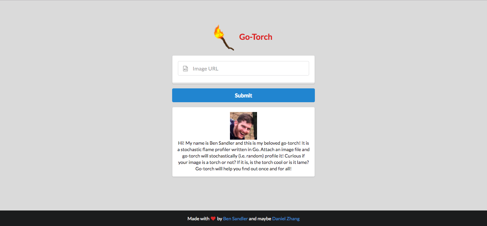
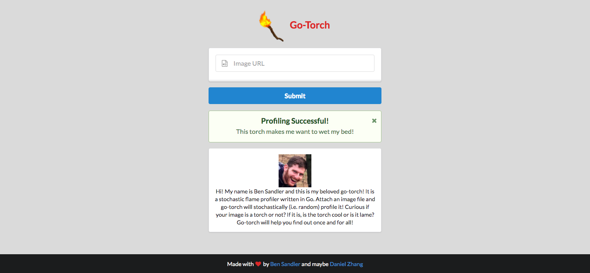

# go-torch

##### go-torch is a stochastic torch profiler written in Go. It takes images and will profile them based on their torchiness.

This is purely a joke for @sandlerben.

## License
[MIT License](LICENSE.md)
